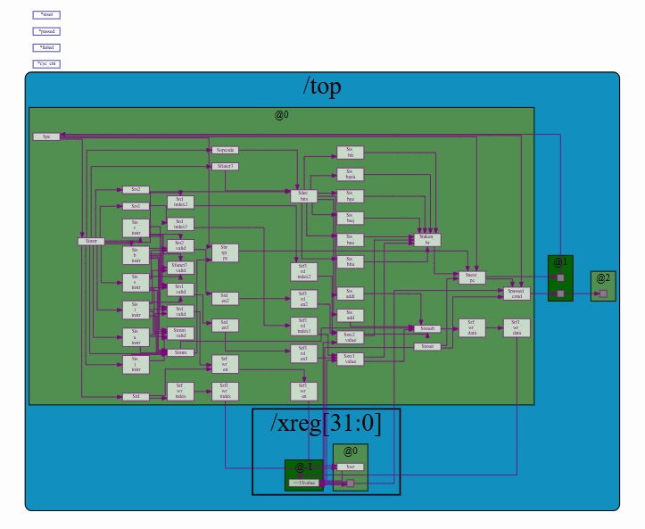
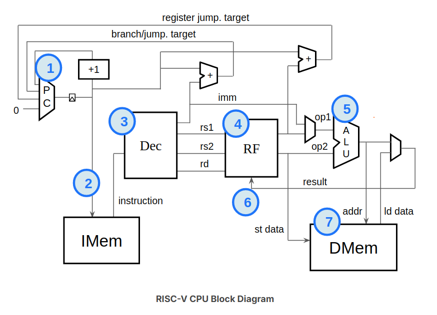

# RISC-V CPU Core

A small educational **32-bit RISC-V CPU core** implemented using **Makerchip / TL-Verilog**.

I built this project while working through Steve Hoover's *Building a RISC-V CPU Core* course to get a better understanding of how processor instructions move from binary encoding to actual execution in hardware.

The implementation is intentionally limited to a subset of RV32I rather than attempting to implement the complete ISA.

## Architecture

At a high level, the core implements the basic processor datapath:

```text
                 ┌─────────────────┐
                 │ Program Counter │
                 └────────┬────────┘
                          │
                          ▼
                 ┌─────────────────┐
                 │ Instruction Mem │
                 └────────┬────────┘
                          │
                          ▼
                 ┌─────────────────┐
                 │     Decode      │
                 │ opcode / regs   │
                 │ immediates      │
                 └───────┬─────────┘
                         │
              ┌──────────┴──────────┐
              ▼                     ▼
      ┌───────────────┐      ┌───────────────┐
      │ Register File │      │   Immediate   │
      │   x0 - x31    │      │  Generation   │
      └───────┬───────┘      └──────┬────────┘
              │                     │
              └──────────┬──────────┘
                         ▼
                  ┌─────────────┐
                  │ ALU / Branch│
                  │    Logic    │
                  └──────┬──────┘
                         │
              ┌──────────┴──────────┐
              ▼                     ▼
       Register write-back      Next PC
```

## Implemented Functionality

The core includes the main pieces required to execute a small subset of RISC-V instructions:

- 32-bit program counter
- instruction fetch
- instruction-type decoding
- register source and destination decoding
- immediate generation
- 32 × 32-bit register file
- register write-back
- arithmetic execution
- conditional branch evaluation
- branch target calculation
- next-program-counter selection

The instruction decoder recognizes the RISC-V instruction formats:

```text
R-type
I-type
S-type
B-type
U-type
J-type
```

Immediate values are reconstructed from the appropriate instruction fields and sign-extended to 32 bits.

## Implemented Instructions

The current execution logic implements a small instruction subset including:

```text
ADDI
ADD

BEQ
BNE
BLT
BGE
BLTU
BGEU
```

This is enough to demonstrate the core instruction pipeline and execute the included test program.

The goal of the project was to understand the underlying CPU architecture rather than implement every RV32I instruction.

## Register File

The core contains a **32-register, 32-bit register file**, matching the basic RISC-V integer register architecture.

Two source registers can be read for instruction execution:

```text
rs1 ──────┐
          │
          ▼
      Register File ────► ALU / branch logic
          ▲
          │
rs2 ──────┘
```

Results are written back to the destination register `rd`.

As required by RISC-V, register `x0` is protected from writes and remains zero.

## Branching

Conditional branches compare the values from `rs1` and `rs2`.

Implemented branch operations include:

```text
BEQ     equal
BNE     not equal

BLT     signed less-than
BGE     signed greater-than or equal

BLTU    unsigned less-than
BGEU    unsigned greater-than or equal
```

When a branch is taken, the branch immediate is added to the current program counter:

```text
branch target = PC + immediate
```

Otherwise execution continues with:

```text
PC = PC + 4
```

## Test Program

The included test program performs a simple summation using RISC-V instructions.

Conceptually:

```text
sum = 0
counter = 1

while counter < 10:
    sum += counter
    counter += 1
```

The program therefore exercises several parts of the CPU simultaneously:

```text
ADDI
  │
  ├── register initialization
  │
ADD
  │
  ├── arithmetic
  │
BLT
  │
  └── loop / program-counter control
```

The final result can be inspected through the Makerchip simulation and CPU visualization.

## CPU Logic Diagram

The following diagram shows the logical structure of the CPU core:



## Makerchip Visualization

Makerchip can visualize the CPU state while the test program is executing:



This makes it possible to inspect the program counter, instruction execution, register values, and other internal signals during simulation.

## Running the Project

The design is intended to run in **Makerchip**.

1. Open [Makerchip](https://makerchip.com/)
2. Launch the Makerchip IDE.
3. Load the contents of `riscv_core_cpu.v`.
4. Compile and run the simulation.
5. Inspect the simulation logs and CPU visualization.

The source uses TL-Verilog together with the RISC-V macros and visualization framework provided by the course environment.

## Scope

This is intentionally **not a complete RISC-V processor**.

Features such as the complete RV32I instruction set, load/store execution, full ALU functionality, exceptions, interrupts, CSRs, pipelining, caches, and physical FPGA implementation are outside the scope of this project.

The purpose was to understand the fundamentals of CPU design:

```text
instruction
    ↓
decode
    ↓
read registers
    ↓
execute
    ↓
write result
    ↓
select next instruction
```

## What I Learned

This project gave me a much clearer understanding of how software instructions translate into digital hardware behavior.

In particular, I worked with:

- RISC-V instruction encoding
- CPU datapath design
- instruction decoding
- immediate generation
- register files
- ALU operations
- signed and unsigned comparisons
- branch logic
- program-counter control
- hardware simulation
- TL-Verilog / Makerchip

Although the implementation is small, building the datapath made the relationship between assembly instructions and the hardware executing them much more concrete.

## Background

This project was created while completing the **Building a RISC-V CPU Core** course by **Steve Hoover / Redwood EDA**.

The course and Makerchip environment provide the surrounding RISC-V macros, testbench, and visualization infrastructure. The project was used as a focused exercise in implementing and understanding the CPU datapath and execution logic.
